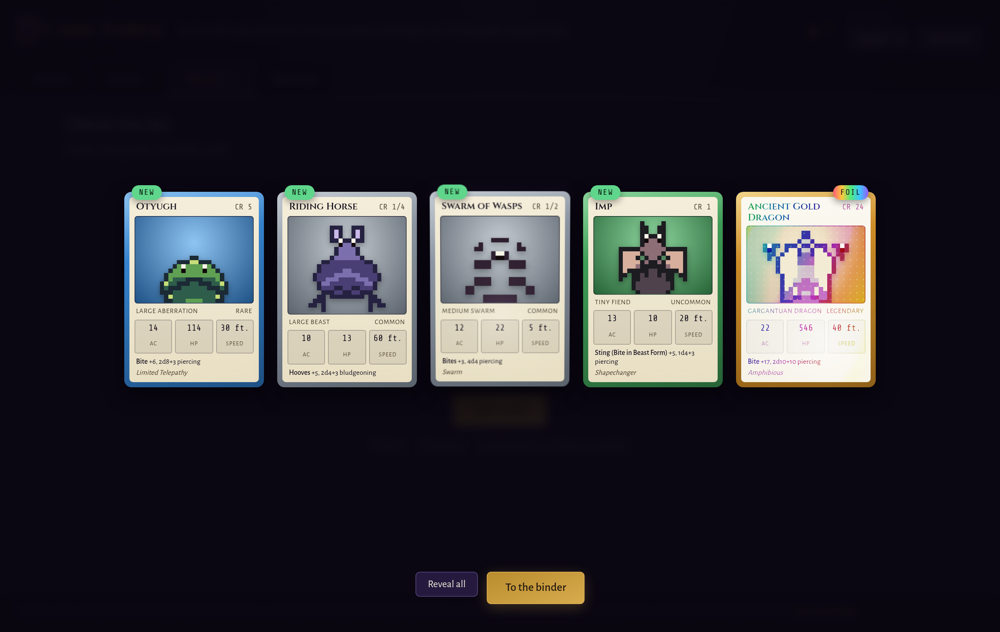
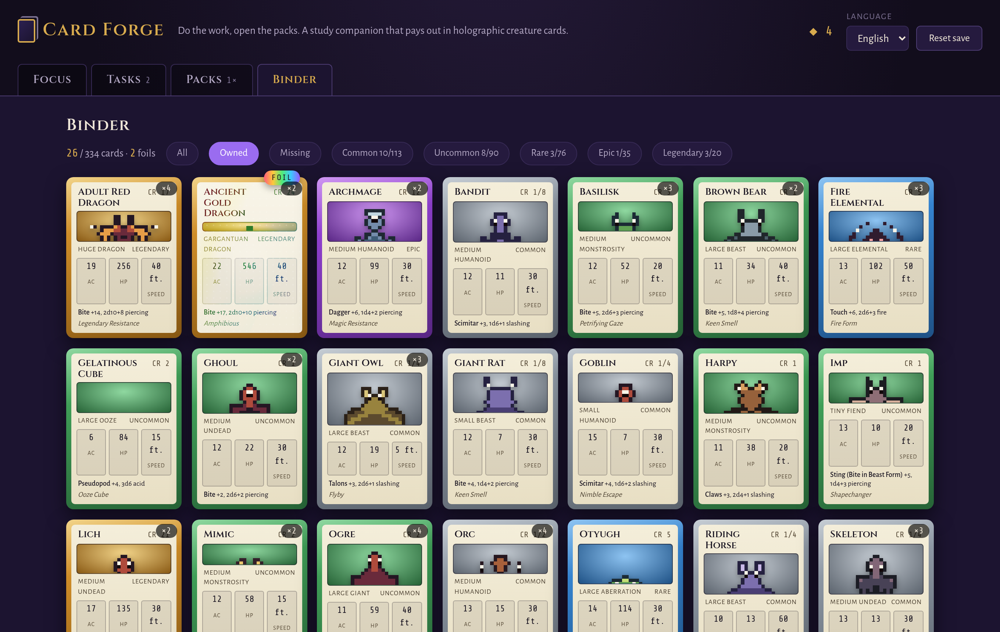

<h1 align="center">Card Forge</h1>

<p align="center">
  <b>Do the work, open the packs.</b><br>
  A study companion that pays out in holographic creature cards: finish focus sessions and real tasks to earn
  points, spend them on five-card packs, and fill a binder with the 334 creatures of the SRD 5.1 bestiary.
  Works offline; your collection never leaves your browser.
</p>

<p align="center">
  
</p>

**Live:** https://ardakalper.github.io/card-forge/

## The loop

1. **Focus** — run an uninterrupted session (5–120 minutes, wall-clock, survives reloads). Finishing pays
   1 point; giving up pays nothing.
2. **Tasks** — a plain to-do list. Each finished task pays 1 point, exactly once: unchecking never refunds,
   so the economy can't be farmed.
3. **Packs** — 3 points buy a pack of 5 cards. Rarity odds ride on every card, the last card rolls upgraded
   odds, and a pity counter guarantees a rare or better at latest every fifth pack.
4. **Binder** — 334 creatures to collect, filtered by rarity and ownership, with completion counts.
   Five spare copies of a card craft its **foil**.

## The cards

- Every creature of the SRD 5.1 bestiary is a card: name, type, size, challenge rating, armor class,
  hit points, speed, signature attack and trait.
- **Rarity comes from the challenge rating**: commons are the rats and goblins of the world, legendaries are
  ancient dragons, liches and the tarrasque. The pyramid lands at 113 / 90 / 76 / 35 / 20.
- **Card art is procedural pixel art**: portraits are generated from the creature's id, so the same monster
  looks the same for everyone. Fifteen silhouette templates by creature type, per-creature body proportions,
  ears, horns, wings and gear, mirrored symmetry, palette shifted by alignment.
- **The holo effect** is pure CSS: cards tilt in 3D under the pointer, a glare follows the cursor, and foils
  add a rainbow gradient in colour-dodge with a sparkle layer. Epics and legendaries shimmer on their own
  during pack reveals.

<p align="center">
  
</p>

## Run it locally

```sh
git clone https://github.com/ardakalper/card-forge
cd card-forge
npm start            # serves app/ on http://localhost:4177
```

## Tests

```sh
npm install
npm run test:unit    # card set integrity, sprite determinism and symmetry, pack odds over 20k rolls,
                     # pity guarantee over 200 packs, economy rules, timer, i18n parity
npm run test:e2e     # Playwright: fake-clock focus session, task economy, a full pack reveal,
                     # binder filters, foil crafting, persistence, Turkish
```

Set `PW_CHROMIUM_PATH=/path/to/chrome` to reuse an installed Chromium. CI runs both suites on every push and
deploys `app/` to GitHub Pages when `main` is green.

## How it is built

```
app/
  index.html      shell: header with wallet, four tabs, reveal overlay
  css/app.css     the game-table look
  css/card.css    the trading card: frame by rarity, pointer-driven tilt, glare and foil layers
  data/cards.json the 334-card set compiled from the SRD bestiary (89 KB)
  js/game.js      pure logic: economy, pack rolling, pity, crafting, focus timer, tasks
  js/gen.js       seeded PRNG and the procedural pixel portrait generator
  js/card.js      card DOM component and tilt wiring
  js/main.js      tabs, reveal flow, binder, persistence
  js/i18n.js      English and Turkish
tools/build-data.mjs  compiles app/data from the 5e-bits/5e-database JSON
```

All randomness flows through one seeded PRNG, so pack contents are reproducible in tests while every save
still gets its own sequence. Everything persists to localStorage; there is no server, no account and no
tracking.

## Legal

Creature names and statistics are from the System Reference Document 5.1 by Wizards of the Coast LLC,
available at https://dnd.wizards.com/resources/systems-reference-document, licensed under the Creative
Commons Attribution 4.0 International License (https://creativecommons.org/licenses/by/4.0/legalcode).
Card artwork is procedurally generated by this project and ships nothing from any game. Card Forge is an
independent tool, not affiliated with Wizards of the Coast or any card game. Fonts are bundled under the
SIL Open Font License 1.1. Code is MIT.

---

### Türkçe özet

**Card Forge**, emeğini kart paketleriyle ödeyen bir çalışma uygulaması. Odak seansı bitir ya da görev
tamamla, puan kazan; 3 puanla 5 kartlık paket aç. Kartlar SRD 5.1 canavar kitabının 334 yaratığı; nadirlik
tehlike derecesinden gelir, en geç beşinci pakette nadir+ garantidir. Kart görselleri prosedürel piksel
sanatı: aynı yaratık herkeste aynı görünür. Kartlar imlecin altında 3B eğilir, folyolar gökkuşağı gibi
parlar; bir kartın 5 fazla kopyası folyosunu bastırır. Klasörde nadirlik ve sahiplik filtreleri, tamamlama
sayaçları var. İşaret kaldırmak puan iade etmez, ekonomi kasılamaz. Çevrimdışı çalışır, koleksiyon
tarayıcında kalır. Türkçe ve İngilizce.
